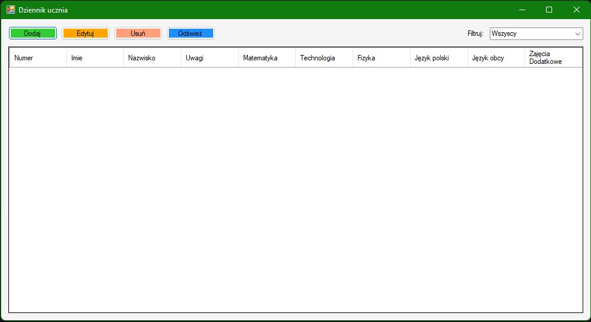
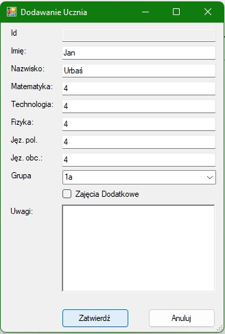
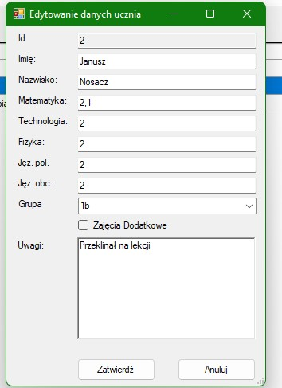
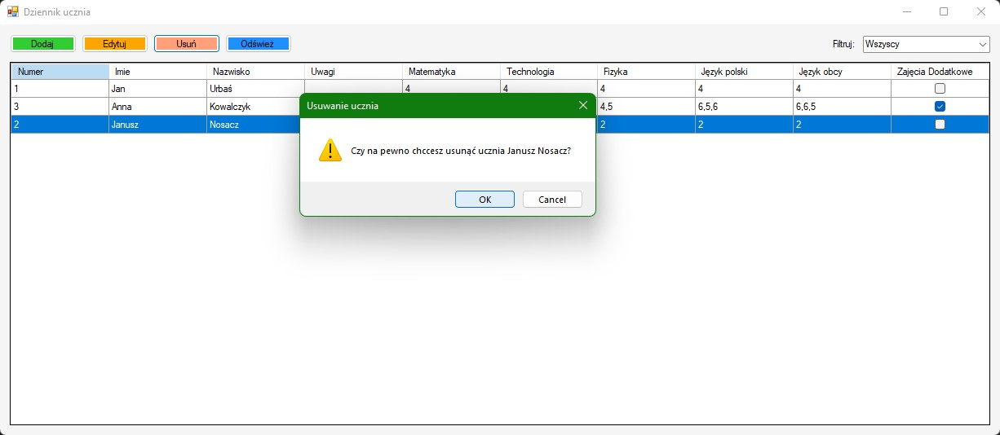

# Students Diary 
Simple Win Forms application to store Student's data.

# Instalation
1. Download app from [release page](https://github.com/Tymisko/StudentsDiary/releases)
1. Extract zip wherever you want.
1. Open StudentsDiary.exe

# Requirements
- .NET Framework 4.8
# Presentation
## Main Window

## Add Student

## Browsing Students

## Edit Student

## Remove Student
